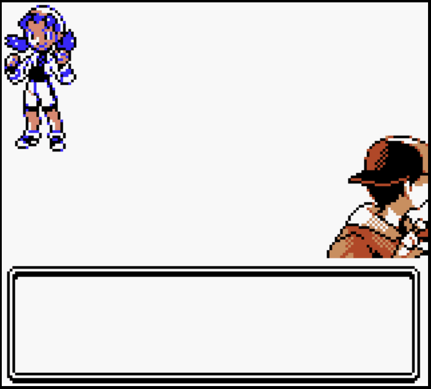

# Crystal Battle Simulator

This project is a *playable* browser simulation of the Pokemon Cystal battle engine.

This uses [modular Pokemon Showdown](https://github.com/pkmn/ps) as the backend, so (almost) every move should be fully functional.

Not every move has been animated yet, see [this file](MOVES.md) for the list of move animations that have been completed.